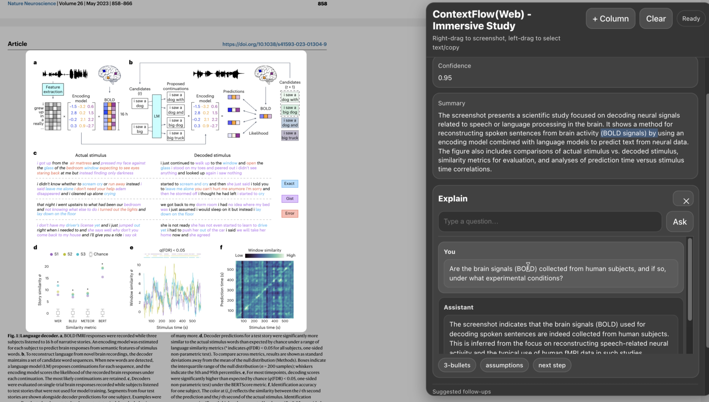

# ContextFlow (Web) – Immersive Study (Prototype)

> An experiment in context flow and continuous human–AI interaction.

ContextFlow is an experimental prototype that explores a central question:

**If selection becomes context input, can AI integrate more naturally into human thinking processes?**

This version is a Web-based prototype focused on PDF study environments.  
Future iterations aim toward system-level (macOS) integration.

---

## Demo



🎥 Demo Video:  
https://youtu.be/Nh3s-5DsVG0

---

# I. Problem Background

Current AI interaction paradigms exhibit three structural limitations.

## 1. Context Separation

Using AI for study today often requires:

- Copying or capturing information  
- Switching to another application (e.g., ChatGPT, Gemini)  
- Manually transferring selected content  
- Receiving a response  
- Returning to the original reading material  
- Reintegrating the AI response into context  
- Switching back again for follow-up questions  
- Repeating the cycle  

AI remains disconnected from the user’s visual field.  
This separation introduces measurable cognitive friction.

---

## 2. Discrete Interaction Structure

The dominant pattern is:

Input → Output → End

However, human reasoning does not proceed in isolated prompt–response units.  
It evolves continuously across context.

---

## 3. AI as an External Tool

AI typically runs in:

- Browser tabs  
- Standalone windows  

It is not embedded within:

- The learning material itself  
- The selection layer  
- The operating system’s broader interaction flow  

AI remains prompt-native rather than context-native.

---

# II. Core Hypothesis

ContextFlow is built on a simple hypothesis:

> Selection is context.

When a user selects a region inside a PDF:

- The screenshot becomes contextual input  
- The system analyzes task type automatically  
- Structured output is generated  
- A continuous session is initiated  
- The user does not need to copy, paste, or restate context  

The system does not begin with an input box.  
It begins with attention focus.

---

# III. What This Prototype Validates

This Web prototype validates the following mechanisms:

- Screenshot-driven context capture  
- JSON Schema–controlled structured output  
- Continuous session state management  
- Layered interaction (initial question + follow-up questions)  

---

## Prototype Architecture

React (PDF rendering + selection layer)  
→ html2canvas (screenshot capture)  
→ Express backend  
→ OpenAI Responses API  
→ Structured JSON output  
→ Continuous session model  

---

## IV. Experimental Goals

This prototype is not a finished product.  
It is designed to observe:

- Can screenshot-based context capture reduce context-transfer friction?  
- Can continuous sessions reduce semantic fragmentation?  
- Can selection become a new interaction primitive?  

---

## V. Future Directions

- macOS global screenshot integration  
- Cross-application continuous context  
- System-level attention layer  
- More natural human-AI collaborative structures  
- Reduction of cognitive friction in knowledge work  

---

## Project Nature

ContextFlow is a research-oriented interaction experiment.  

Its goal is not to provide a complete solution,  
but to explore how AI might evolve from a prompt-based tool  
into a context-native layer within operating systems.

---


# VII. Installation & Usage

This section explains how to run ContextFlow locally and how users interact with the system once it is running.

## 1. Prerequisites

Make sure the following are installed:

- Node.js 18 or higher
- npm 9 or higher
- A valid OpenAI API key

## 2. Install Dependencies

Install frontend dependencies from the project root:

```bash
npm install
```

Install backend dependencies:

```bash
cd server
npm install
cd ..
```

## 3. Environment Configuration

Create a `.env` file in `server/`:

```env
OPENAI_API_KEY=your_openai_api_key_here
```

Notes:

- Keep your API key private.
- Use `server/.env.example` as a template if needed.

## 4. Run the Application

Start backend server (Terminal A):

```bash
cd server
npm run dev
```

Backend default URL: `http://localhost:3001`

Start frontend app (Terminal B, project root):

```bash
npm run dev
```

Frontend default URL: `http://localhost:5173`


## 5. How to Use (Interaction Model)

### 5.1 PDF Interaction

- Left click + drag: select PDF text normally for copy/paste.
- Right click + drag: capture a screenshot region for AI analysis.

### 5.2 Explain Panel

After a valid right-drag screenshot:

- The system analyzes the selected region.
- A summary is generated.
- The `Explain` panel becomes available for follow-up questions.

The chat endpoint is configured as a general-purpose assistant.  
Users can ask both screenshot-related and unrelated questions.

### 5.3 Replace the PDF Source

The PDF shown in the web app is replaceable.

- Put your own PDF file in `public/`.
- Keep the filename exactly the same: `sample.pdf`.
- In other words, replace `public/sample.pdf` with your file using the same name.


## Limitations

- The current version only supports PDF within a web environment.
- Screenshot capture is limited to visible viewport.
- Conversation memory is session-scoped and not persistent.
